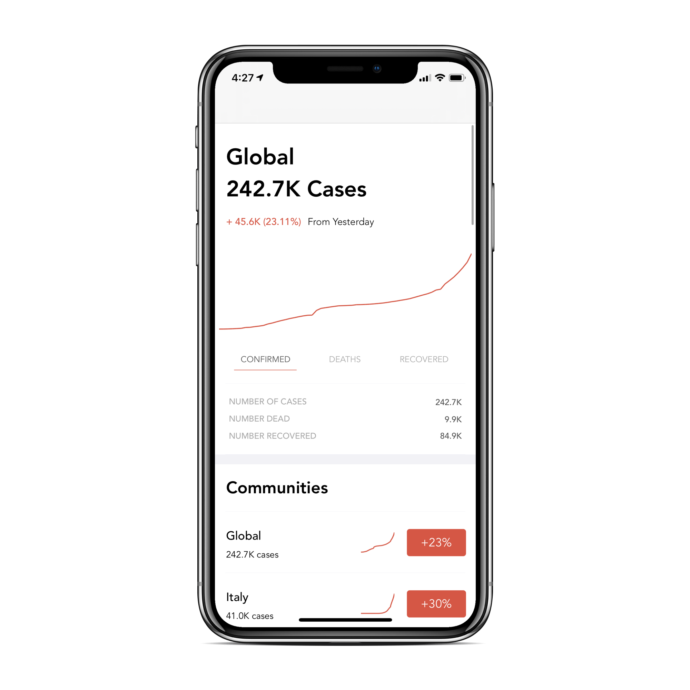
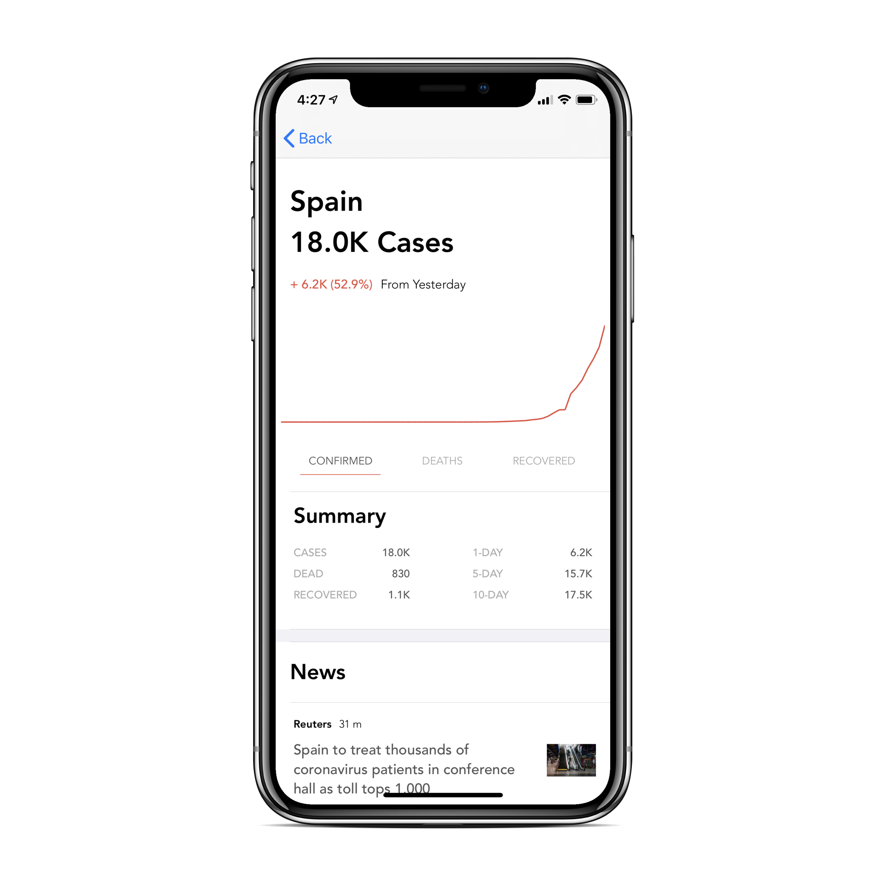
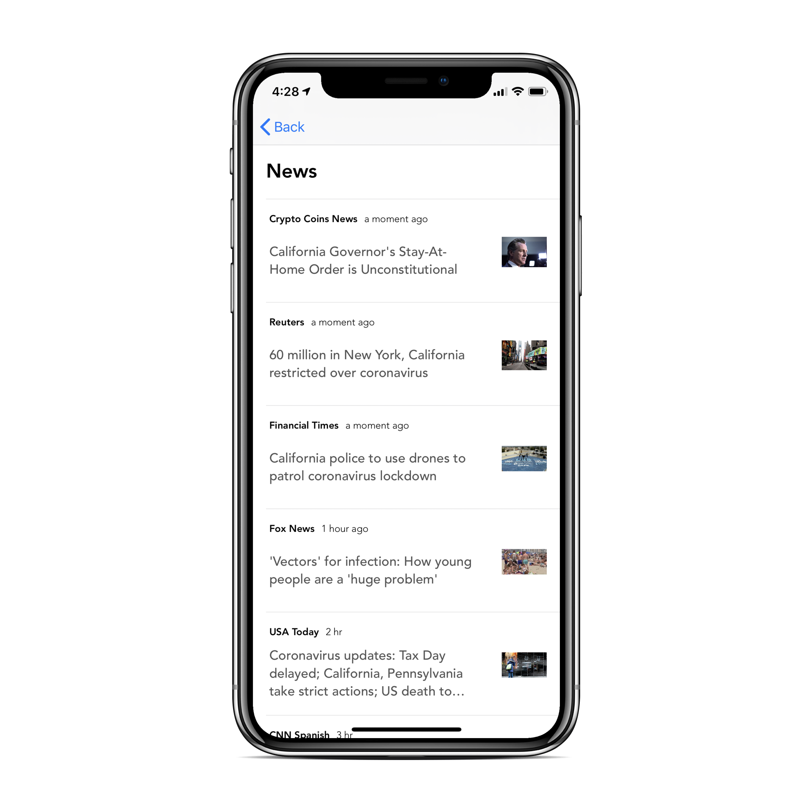

# Bend the Curve: A COVID-19 Statistics Tracking App

This project is an iOS App inspired by the Robinhood UI/UX to effectively track COVID-19 cases across the World. All data is sourced from the [JHU CSSE Dataset of Novel Coronavirus Cases](https://github.com/CSSEGISandData/COVID-19).

The app runs on a Firebase Backend, with Firebase Cloud Functions connected to a Google Cloud Scheduler job performing the daily update of the dataset. News articles are sourced from [NewsAPI.org](https://newsapi.org/).

Unfortunately, Apple is rejecting COVID-19 apps from the App Store unless they're published by an authorized source. Please shoot me an email if you'd like an invite code to download this app via TestFlight!

### Screenshots

